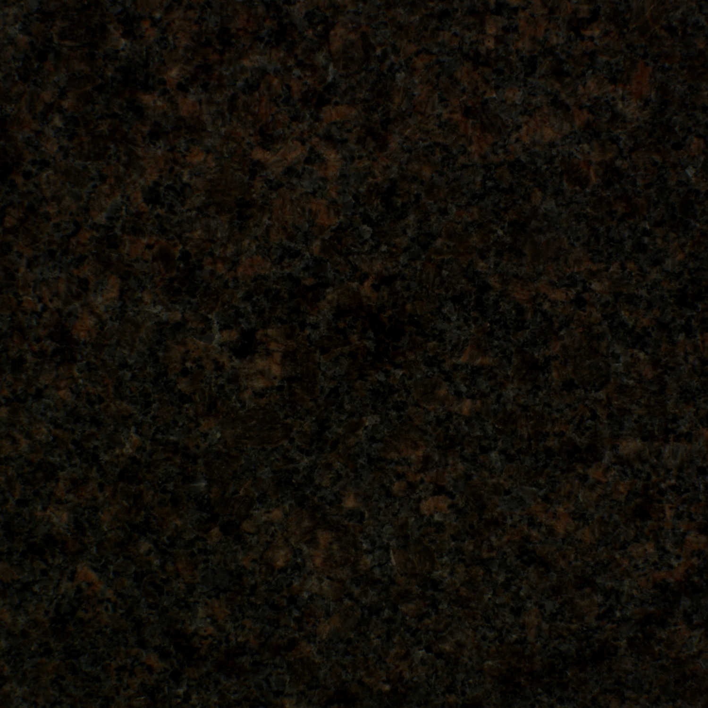
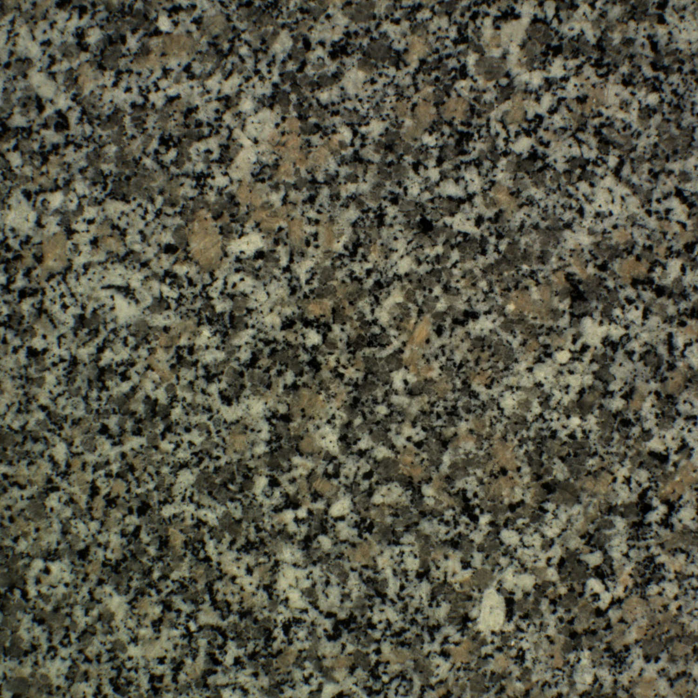
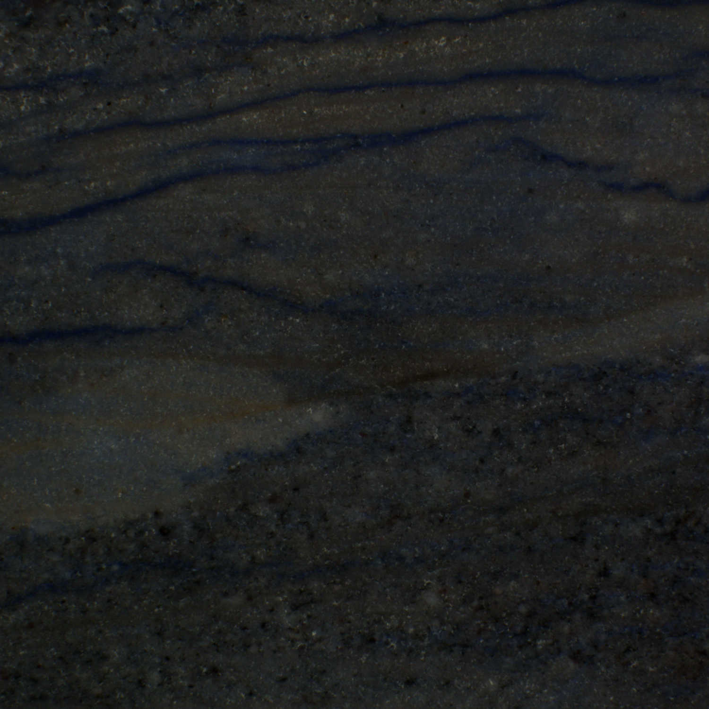
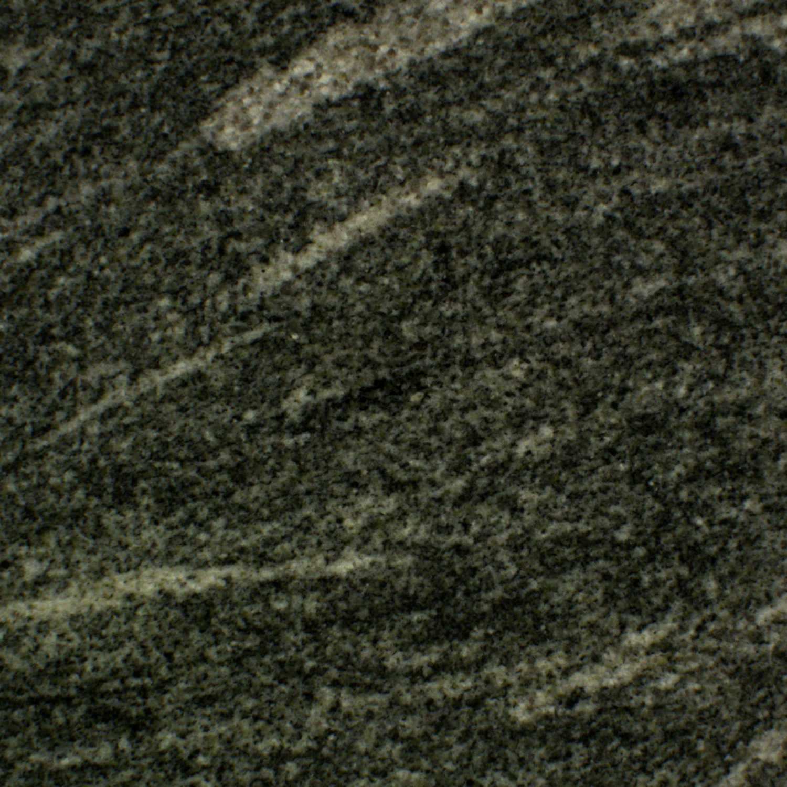

# MondialMarmi: A collection of images of polished natural stones for colour and texture analysis

## [Description](#description)
## [Image acquisition](#image-acquisition)

## Description
MondialMarmi is a collection of colour images of polished natural stones for image processing purposes. It was originally conceived for benchmarking colour and texture descriptors.

The current version contains 25 classes, and there are four images for each class. Each image correspond to one tile. The images were acquired under controlled illumination conditions (see [Image Acquisition](#image-acquisition) for a description of the acquisition setup). Each tile was imaged under the following in-plane rotation angles: 0°, 10°, 20°, 30°, 40°, 50°, 60°, 70°, 80° and 90°.

### Classes
<table>

  <!---- First row ---->
  <tr>
    <td align="center" valign="top">
      
    </td>
    <td align="center" valign="top">
      
    </td>
    <td align="center" valign="top">
      
    </td>
    <td align="center" valign="top">
      
    </td>
    <td align="center" valign="top">
      
    </td>
  </tr>
  <tr>
    <td align = "center">Acquamarina</td>
    <td align = "center">Azul Capixaba</td>
    <td align = "center">Azul Platino</td>
    <td align = "center">Baltic Brown</td>
    <td align = "center">Bianco Cristal</td>
  </tr>

  <!---- Second row ---->
  <tr>
    <td align="center" valign="top">
        
    </td>
    <td align="center" valign="top">
        
    </td>
    <td align="center" valign="top">
        
    </td>
    <td align="center" valign="top">
        
    </td>
    <td align="center" valign="top">
        
    </td>
  </tr>
  <tr>
    <td align = "center">Bianco Sardo</td>
    <td align = "center">Blue Pearl</td>
    <td align = "center">Dakota Mahogany</td>
    <td align = "center">Giallo Antico</td>
    <td align = "center">Giallo Napoletano</td>
  </tr>

  <!---- Third row ---->
  <tr>
    <td align="center" valign="top">
        
    </td>
    <td align="center" valign="top">
        
    </td>
    <td align="center" valign="top">
        
    </td>
    <td align="center" valign="top">
        
    </td>
    <td align="center" valign="top">
        
    </td>
  </tr>
  <tr>
    <td align = "center">Giallo S. Cecilia</td>
    <td align = "center">Giallo Veneziano</td>
    <td align = "center">Kashmir Gold</td>
    <td align = "center">Nero Africa</td>
    <td align = "center">Paradiso Bash</td>
  </tr>

  <!---- Fourth row ---->
  <tr>
    <td align="center" valign="top">
        
    </td>
    <td align="center" valign="top">
        
    </td>
    <td align="center" valign="top">
        
    </td>
    <td align="center" valign="top">
        
    </td>
    <td align="center" valign="top">
        
    </td>
  </tr>
  <tr>
    <td align = "center">Paradiso Classico</td>
    <td align = "center">Rosa Monçao</td>
    <td align = "center">Rosa Porriño</td>
    <td align = "center">Rosso Multicolor</td>
    <td align = "center">Sky Brown</td>
  </tr>

  <!---- Fifth row ---->
  <tr>
    <td align="center" valign="top">
        
    </td>
    <td align="center" valign="top">
        
    </td>
    <td align="center" valign="top">
        
    </td>
    <td align="center" valign="top">
        
    </td>
    <td align="center" valign="top">
        
    </td>
  </tr>
  <tr>
    <td align = "center">Verde Bahía</td>
    <td align = "center">Verde Marino</td>
    <td align = "center">Verde Ming</td>
    <td align = "center">Verde Oliva</td>
    <td align = "center">Violetta</td>
  </tr>

</table>

## Usage and organisation
1. Download the dataset from [images.zip](https://drive.google.com/file/d/1001xz0vafHuklEK_Byyfv6QhvXJyasD-/view?usp=sharing)
2. Unzip the folder

Once uncompressed the dataset has the following structure:

`./<rotationAngle>/<className_rotationAngle_sample>.bmp`

- `<rotationAngle>` indicates the in-plane rotation angle at which the tile was imaged. This can be `00`, `10`, `20`, `30`, `40`, `50`, `60`, `70`,  `80` or `90`.
- `<className>` represents the class name — that is, the commercial denomination of the granite. This can be any of the 25 class names listed above.
- `<sample>` is a two-digit code that uniquely identifies the tile. There are four tiles for each class and angle). 

## Image acquisition

## Contributors
[Francesco Bianconi](https://www.bianconif.net) and [Antonio Fernández](http://antfdez.webs.uvigo.es/)

## How to cite
If you wish to use this dataset for your research activity please consider referencing the following papers (where appropriate):

1. Bello-Cerezo, R., Bianconi, F., Fernández, A., González, E., Di Maria, F. [Experimental comparison of color spaces for material classification](https://www.spiedigitallibrary.org/journals/journal-of-electronic-imaging/volume-25/issue-6/061406/Experimental-comparison-of-color-spaces-for-material-classification/10.1117/1.JEI.25.6.061406.short?SSO=1) (2016) Journal of Electronic Imaging, 25 (6), art. no. 061406
2. Bianconi, F., González, E., Fernández, A., Saetta, S.A.
[Automatic classification of granite tiles through colour and texture features](https://www.sciencedirect.com/science/article/abs/pii/S0957417412005751) (2012) Expert Systems with Applications, 39 (12), pp. 11212-11218.

## Acknowledgements
We are grateful to [Mondial Marmi s.r.l.](https://www.mondialmarmi.com/) (Perugia, ITALY) for providing the natural stone tiles used to make up this dataset.

The work was partially funded by the European Commission under project LIFE12 ENV/IT/000411 “Enhanced material recovery and environmental sustainability for small scale waste management systems”  - EMaRES”.

For their support during the image acquisition process we would like to thank:

- [Raquel Bello Cerezo](https://www.linkedin.com/in/raquelbellocerezo/)
- Stefano Baglioni

For technical support and logistics:

- [Stefano Antonio Saetta](https://www.linkedin.com/in/saetta/)

## License
Distributed under Creative Commons Attribution-NonCommercial-ShareAlike 4.0 International ([CC BY-NC-SA 4.0](https://creativecommons.org/licenses/by-nc-sa/4.0/))

## Disclaimer
The information and content available on this repository are provided with no warranty whatsoever. Any use for scientific or any other purpose is conducted at your own risk and under your own responsibility. The authors are not liable for any damages - including any consequential damages - of any kind that may result from the use of the materials or information available on this repository or of any of the products or services hereon described.
